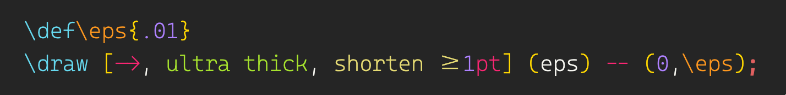

Syntax highlighting for TikZ inside LaTeX documents, with commands to build and view the
figure you are editing.

```tex
\draw [->, ultra thick, shorten >=1pt] (eps) -- (0,\eps);
```

Stock LaTeX grammars colour that as one undifferentiated line. Here `->` is an operator,
`ultra thick` a style reference, `shorten >` a key, `1pt` a number with its unit, `--` a
path join, `(eps)` a coordinate and `\eps` a variable — because the file `\def`s it two
lines up. Every token maps to a conventional TextMate scope with a `.tikz` suffix, so the
colours come from whichever theme you use.



*The same two lines as the editor draws them: `\eps` is amber at its `\def` and again
at its use, while `\draw` stays cyan — a distinction no grammar can make on its own.*

## Building a figure

Bind the two commands to keys, in `keybindings.json`:

```jsonc
{ "key": "f6", "command": "runCommands",
  "args": { "commands": ["workbench.action.files.saveAll", "tikz.build"] },
  "when": "!terminalFocus" },
{ "key": "f7", "command": "tikz.view", "when": "!terminalFocus" }
```

`F6` builds and reports the outcome in a notification; `F7` hands the PDF to an
external viewer. Both act on the file you are looking at — one in a figure folder counts
as a figure, anything else as the document.

The extension does not build anything itself. `F6` runs a shell script from your
project, because only your project knows which preamble a figure has to compile
against, and guessing that is how a build tool becomes a build system. Copy
`examples/fig.sh` and `examples/build.sh` into your project and change the preamble
line. Each script is given the figure's path as `$1`, runs from the folder it was found
in, and reports by writing one line to `build/.build-status`, either `ok <message>` or
`fail <message>`; without that file the exit code is used. Press `F6` with no script in
place and the editor will offer you the example.

`TikZ: Rebuild style index` re-scans the workspace for `/.style` definitions.

## Install

```sh
./tools/package
code --install-extension tikz-vscode-ext-0.1.0.vsix
```

Reload the window, then merge `settings-snippet.jsonc` into your user `settings.json`;
its `editor.semanticTokenColorCustomizations.enabled` line is required, as many themes
ship semantic highlighting off. `./tools/tm tools/theme-check.mjs` reports the tokens
your theme leaves the colour of ordinary text, to be given one there.

## Layout

What the defaults expect, all of it adjustable below:

```
your-project/
└── latex/                  ← searched for the scripts: tikz.scriptFolders
    ├── main.tex
    ├── preamble.tex
    ├── fig.sh              ← copied from examples/
    ├── build.sh
    ├── ch1-figs/           ← a figure folder: tikz.figureFolders
    │   └── flowchart.tex
    └── build/
        ├── fig.pdf         ← tikz.figurePdf
        ├── main.pdf        ← tikz.documentPdf
        └── .build-status   ← what the script reports back
```

The scripts are looked for in each `tikz.scriptFolders` entry in turn and the first hit
wins, so sources can sit in a subdirectory or at the root. A file counts as a figure when
the name of the folder holding it matches `tikz.figureFolders`; the PDFs are resolved
against the same folder as the scripts.

## Settings

| Setting | Default | |
|---|---|---|
| `tikz.figureScript` | `./fig.sh` | script for a figure |
| `tikz.buildScript` | `./build.sh` | script for the document |
| `tikz.figureFolders` | `(?:[A-Za-z0-9_]+-figs\|tikz-figs\|tikz-code)` | folder names holding figures |
| `tikz.scriptFolders` | `[".", "latex"]` | where the scripts and PDFs are, searched in order |
| `tikz.figurePdf` | `build/fig.pdf` | PDF to view from a figure |
| `tikz.documentPdf` | `build/main.pdf` | PDF to view otherwise |
| `tikz.viewer` | `""` | viewer application; empty means the newest `/Applications/texstudio*.app` |

## Licence

MIT.
